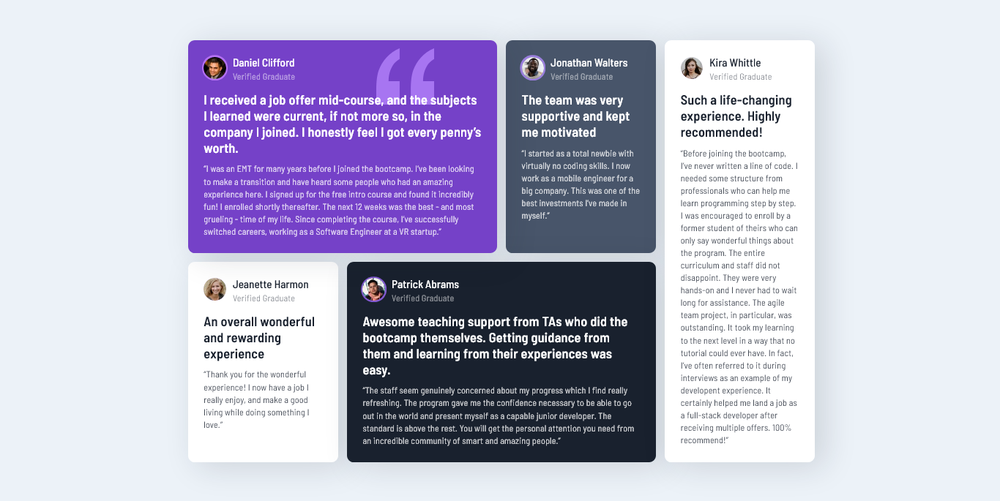

# Frontend Mentor - Testimonials grid section solution

This is a solution to the [Testimonials grid section challenge on Frontend Mentor](https://www.frontendmentor.io/challenges/testimonials-grid-section-Nnw6J7Un7). Frontend Mentor challenges help you improve your coding skills by building realistic projects. 

## The challenge

Users should be able to view the optimal layout for the site depending on their device's screen size

## Screenshot

### Links

- [Live Website](https://vietan0.github.io/FM-testimonials-grid-section/)
- [Solution Page on Frontend Mentor](https://www.frontendmentor.io/solutions/testimonials-grid-section-ktS2aLh-H)

## Built with

- Semantic HTML5 markup
- CSS variables
- Flexbox
- CSS Grid

## Useful resources

- [Kevin Powell's tips about CSS Grids](https://www.youtube.com/watch?v=rg7Fvvl3taU)

## Author

-   Frontend Mentor - [@vietan0](https://www.frontendmentor.io/profile/vietan0)
-   Linkedin - [@vietan](https://www.linkedin.com/in/vietan/)